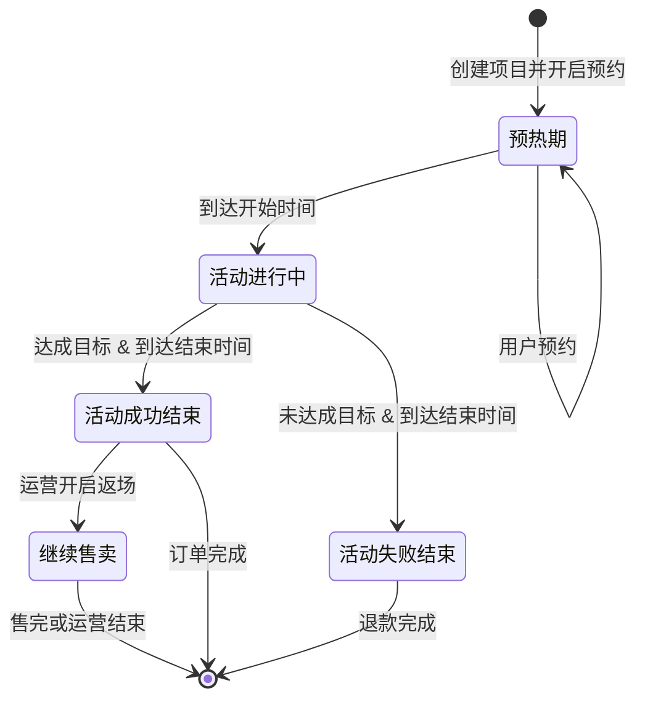
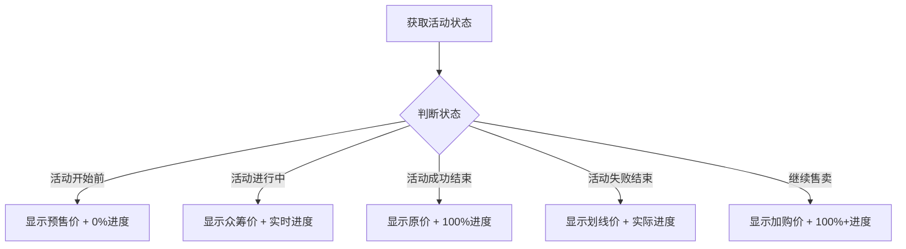

# 众筹 PRD v1.2

## 1. 项目信息与版本记录
- **产品名称**：众筹
- **版本**：v1.2
- **负责人**：林长宇
- **创建时间**：2026-04-10

### 版本迭代记录
| 版本 | 日期 | 变更项 | 负责人 |
| --- | --- | --- | --- |
| v1.0 | 2026-04-10 | 初始版本，需求采集完成，包含后台项目管理、APP端浏览与参与众筹、档位SKU配置、多级目标激励、预约与限购封顶等核心功能 | 林长宇 |
| v1.1 | 2026-04-12 | 技术架构升级：① 所有外部资源本地化(CDN→本地部署)；② 实现iframe池预加载技术，页面切换性能提升100-300倍；③ 主控文档版本切换功能优化；④ 完善文件架构和版本管理 | 林长宇 |
| v1.2 | 2026-04-12 | App端UI细节优化：众筹详情页价格条和进度条组件优化，新增5种活动状态（活动开始前、活动进行中、活动成功结束、活动失败结束、活动成功达标后继续售卖），每种状态对应不同的价格展示、进度展示和吸底按钮 | 林长宇 |

## 2. 需求背景与目标
### 2.1 现状问题与痛点
电商平台目前已有成熟的商城功能，但是没有针对众筹的场景，希望在电商平台中添加众筹功能。

### 2.2 需求提出的必要性
需求落地后，实现平台/商家快速上线众筹项目，实现众筹项目成功。

### 2.3 业务目标
| 目标类型 | 描述 | 衡量指标 | 目标值 |
| --- | --- | --- | --- |
| 平台赋能 | 支持快速上线众筹项目 | 项目上线周期 | ≤3天 |
| 业务增长 | 提升众筹项目成功率 | 众筹成功率 | ≥70% |
| 用户参与 | 提升用户参与众筹体验 | 用户满意度 | ≥85% |
| UI体验 | 清晰传达活动状态 | 用户对活动状态理解度 | ≥90% |

## 3. 用户与使用场景
### 3.1 核心用户
- **运营团队**：在运营后台配置众筹项目
- **C端用户**：通过APP浏览并参与众筹

### 3.2 典型场景
1. 运营在运营后台配置新的商品类型，配置商品详情、商品价格、众筹目标、众筹时间等
2. 用户通过商城APP浏览众筹商品详情，点击"众筹"按钮，选择SKU，付费参加众筹
3. 众筹成功，安排生产和发货；众筹不成功，订单退款

### 3.3 核心用户旅程
| 阶段 | 用户触点 | 用户行为 | 痛点/情绪 | 产品机会 |
| --- | --- | --- | --- | --- |
| 发现 | 众筹列表页 | 浏览众筹项目，查看进度 | 好奇：有哪些项目？ | 突出热门项目，清晰展示进度 |
| 决策 | 众筹详情页 | 查看项目详情、目标、档位、多级奖励 | 犹豫：是否值得参与？ | 展示多级目标激励机制 |
| 预约 | 预热期预约 | 点击预约，设置开售提醒 | 期待：不想错过 | 预约功能保留名额 |
| 购买 | SKU选择与支付 | 选择档位SKU，填写信息，支付全款 | 紧张/期待 | 全款支付+7天无理由 |
| 达成 | 项目成功/失败 | 查看项目状态更新 | 兴奋/失落 | 成功则发货，失败则退款 |
| 追踪 | 订单/物流 | 查看订单状态、物流信息 | 期待 | 清晰展示生产与发货进度 |

## 4. 需求功能清单

### 4.1 运营后台端功能
| 功能模块 | 功能点 | 优先级 | 功能标识 |
| --- | --- | --- | --- |
| 众筹玩法 - 项目列表 | 顶部工具栏左侧为项目名称关键搜索框，右侧为创建按钮（弹窗展示创建项目表单）；列表区查看所有众筹项目，展示项目基本信息、目标、进度、状态，操作按钮区（编辑、SKU管理、多级奖励、禁用/启用）；底部翻页区 | P0 | admin_project_list |
| 众筹玩法 - 项目列表 - 项目创建/编辑弹窗 | 展示创建/编辑项目的表单，包含项目基础信息、时间控制、目标配置类型、成功判定规则 | P0 | admin_project_list_create |
| 众筹玩法 - 项目列表 - SKU与限购管理弹窗 | 展示创建/编辑SKU与限购的表单，包含SKU名称、库存、限购状态 | P0 | admin_project_list_sku |
| 众筹玩法 - 项目列表 - 多级奖励管理弹窗 | 展示创建/编辑多级奖励的表单，包含奖励名称、描述、目标、奖励类型等 | P0 | admin_project_list_benfit |
| 众筹玩法 - 众筹订单 | 查看众筹订单、用户信息 | P0 | admin_order_manage |

### 4.2 APP端功能
| 功能模块 | 功能点 | 优先级 | 功能标识 |
| --- | --- | --- | --- |
| 众筹详情页 | 展示众筹商品封面图/视频，标题、目标与进度条，讨论区入口，商品详情，吸底预约/参加/支持按钮 | P0 | app_project_detail |
| 众筹详情页 - 价格条组件 | **【v1.2新增】** 价格条组件支持5种活动状态展示：活动开始前（预售价）、活动进行中（众筹价）、活动成功结束、活动失败结束（原价）、活动成功达标后继续售卖（加购价） | P0 | app_project_detail_price_bar |
| 众筹详情页 - 进度条组件 | **【v1.2新增】** 进度条组件支持5种活动状态展示：活动开始前（0%）、活动进行中（实时进度）、活动成功结束（100%）、活动失败结束（实际进度）、活动成功达标后继续售卖（100%+） | P0 | app_project_detail_progress_bar |
| 众筹详情页 - 多级奖励弹层 | 点击进度条区弹出多级奖励介绍的弹层，简称、描述、解锁条件、奖励类型、奖励模式 | P0 | app_project_detail_benfit |
| 众筹详情页 - SKU选择弹层 | 展示可选SKU，吸底"去支持"按钮跳转支付 | P0 | app_project_detail_sku_picker |
| 众筹讨论区 | 已有话题讨论产品功能，仅描述逻辑 | - | app_comments |
| 我的众筹订单管理 | 在已有"我的订单"功能基础上，新增查看我的众筹订单，支持退款查看进度等操作 | P0 | app_orders |

### 4.3 功能依赖关系
```
graph TD
    A[众筹项目概览] --> B[目标与进度条]
    A --> C[多级目标区]
    A --> D[档位/SKU选择区]
    A --> E[项目详情]
    A --> F[评论区]
    B --> G[预约功能]
    D --> H[参与众筹]
    H --> I[订单管理]
```

## 5. 详细方案（带功能标识）

### 5.1 运营后台详细方案

#### 5.1.1 众筹玩法 - 项目列表 [admin_project_list]
- 展示所有众筹项目列表
- 顶部工具栏左侧为项目名称关键搜索框
- 顶部工具栏右侧为创建按钮（弹窗展示创建项目表单）
- 列表区显示基本信息、目标、进度、状态
- 操作按钮区（编辑、SKU管理、多级奖励、禁用/启用）
- 底部翻页区

#### 5.1.1.1 项目创建/编辑弹窗 [admin_project_list_create]
- 项目基础信息（关联商品ID、众筹标题）
- 时间控制（众筹开始/结束、是否开启预约）
- 目标配置类型（SPU级别金额目标或件数目标）
- 成功判定规则（达成目标值，0表示必须达成）

#### 5.1.1.3 SKU与限购管理弹窗 [admin_project_list_sku]
- 展示所有SKU，名称、价格、规格属性
- 用户限购设置，SPU级限购或SKU级限购
- SKU级库存（0代表无限制）
- 预计发货期标签

#### 5.1.1.4 多级奖励配置弹窗 [admin_project_list_benfit]
- 展示多级奖励配置，简称、描述、解锁条件、奖励类型、奖励模式
- 简称
    - 展示在进度条下方，2-8个字
- 描述
    - 中文描述，2-99个字
- 解锁条件（按项目总进度，金额或件数）
    - 设置数值，1-999999
- 奖励类型（规格升级/赠品加送/线下权益）
- 奖励模式（全员赠送/抽选）
    - 抽选类型需要配置奖励配额

#### 5.1.2 订单管理 [admin_order_manage]
- 查看众筹订单列表
- 搜索、订单状态筛选


### 5.2 APP端详细方案

#### 5.2.1 众筹详情页 [app_project_detail]
- **页面布局结构**
    - 顶部区域：展示众筹商品封面图/视频（支持轮播）
    - 标题区：项目名称、副标题、类目、商家信息
    - **价格条区**：根据活动状态动态展示价格信息（详见5.2.1.1）
    - **进度条区**：根据活动状态动态展示进度信息（详见5.2.1.2）
    - 讨论区入口：跳转至众筹讨论区
    - 多级奖励入口：点击进度条区域弹出多级奖励弹层
    - 商品详情区：详细描述图文、FAQ常见问题、风险提示与承诺
    - **吸底操作栏**：根据项目状态动态显示按钮（详见5.2.1.3）

- **交互逻辑**
    - 预热期：显示"预约"按钮，点击后进入预约流程
    - 进行中：显示"参加"按钮，点击后弹出SKU选择弹层
    - 已结束：显示"查看结果"按钮，跳转至订单管理
    - 支持分享功能，可分享至社交平台

#### 5.2.1.1 价格条组件 [app_project_detail_price_bar]

**组件说明**：价格条组件用于展示商品价格信息，根据活动状态显示不同的价格样式和标签。

**5种活动状态对应的价格条展示**：

| 阶段 | 价格样式 | 标签 | 辅助信息 |
|------|---------|------|---------|
| ① 活动开始前 | 预售价 ¥XXX | 即将开始 | 显示"距离开售"倒计时 |
| ② 活动进行中 | 众筹价 ¥XXX | 实时价格 | 显示"已省¥XX"（对比原价） |
| ③ 活动成功结束 | ¥XXX | 已结束 | 显示"活动已结束，已达标" |
| ④ 活动失败结束 | ¥XXX（划线原价） | 已结束 | 显示"活动已结束，未达标，已退款" |
| ⑤ 成功达标后继续售卖 | 加购价 ¥XXX | 返场特惠 | 显示"限时加购" |

**UI规范**：

```
┌─────────────────────────────────────────────────────┐
│  [标签]                              [辅助信息]       │
│  ¥ 价格                                      ¥ 原价  │
└─────────────────────────────────────────────────────┘
```

- 标签样式：
  - "即将开始"：橙色渐变背景 #FF9F43 → #FFC107
  - "实时价格"：紫色渐变背景 #9174E1 → #6FFFAB
  - "已结束"：灰色背景 #999999
  - "返场特惠"：红色渐变背景 #FF5869 → #F92121
- 价格字体：DIN Alternate Bold 24px
- 原价：删除线样式，#999999 14px
- 辅助信息：#666666 12px

#### 5.2.1.2 进度条组件 [app_project_detail_progress_bar]

**组件说明**：进度条组件用于展示众筹项目进度，根据活动状态显示不同的进度样式。

**5种活动状态对应的进度条展示**：

| 阶段 | 进度条样式 | 状态文本 | 辅助数据 |
|------|-----------|---------|---------|
| ① 活动开始前 | 0%，灰色底条 | "即将开始" | 显示预约人数 |
| ② 活动进行中 | X%，彩色渐变填充 | "已支持X人" | 显示剩余时间、距目标 |
| ③ 活动成功结束 | 100%，绿色填充 #28a745 | "已成功" | 显示最终支持人数 |
| ④ 活动失败结束 | X%（实际进度），灰色填充 | "未达标，已退款" | 显示实际支持人数 |
| ⑤ 成功达标后继续售卖 | 100%+，绿色填充，可显示超额比例 | "已解锁全部奖励" | 显示"继续加购"引导 |

**UI规范**：

```
┌─────────────────────────────────────────────────────┐
│  [状态图标] 状态文本                    [辅助数据]   │
│  ████████████░░░░░░░░░░░░░░░░░  XX.X%              │
│  已支持 X,XXX 人 · 剩余 XX 天                        │
└─────────────────────────────────────────────────────┘
```

- 进度条高度：8px，圆角4px
- 灰色底条：#F0F0F0
- 进行中渐变：#FF5869 → #F92121（红色渐变）
- 成功绿色：#28a745
- 失败灰色：#999999
- 状态文本字体：PingFang SC Medium 14px
- 百分比字体：DIN Alternate Bold 17px

#### 5.2.1.3 吸底操作栏组件 [app_project_detail_bottom_bar]

**组件说明**：吸底操作栏固定在页面底部，根据活动状态显示不同的操作按钮。

**5种活动状态对应的按钮展示**：

| 阶段 | 按钮文案 | 按钮样式 | 辅助功能 |
|------|---------|---------|---------|
| ① 活动开始前 | 立即预约 | 紫色渐变 #9174E1 → #6FFFAB | 右侧显示预约人数 |
| ② 活动进行中 | 立即参与 | 红色渐变 #FF5869 → #F92121 | 右侧显示"去看看" |
| ③ 活动成功结束 | 查看订单 | 绿色 #28a745 | 跳转订单详情 |
| ④ 活动失败结束 | 查看退款 | 灰色 #999999 | 跳转退款进度 |
| ⑤ 成功达标后继续售卖 | 立即加购 | 红色渐变 #FF5869 → #F92121 | 显示限时标识 |

**UI规范**：

```
┌─────────────────────────────────────────────────────┐
│  [客服图标]                        [主按钮:文案]   │
│             [辅助信息]                                │
└─────────────────────────────────────────────────────┘
```

- 底部固定栏高度：80px（含安全区域）
- 按钮高度：48px，圆角24px
- 按钮字体：PingFang SC Medium 16px
- 左侧客服图标：44px × 44px，边框1px #E4E7ED

#### 5.2.2 众筹详情页 - 多级奖励弹层 [app_project_detail_benfit]
- **触发方式**
    - 点击详情页进度条区域弹出该弹层

- **弹层内容结构**
    - 弹层标题：多级奖励说明
    - 奖励列表区：展示所有配置的多级奖励
        - 简称（2-8个字）：醒目展示在奖励卡片顶部
        - 解锁条件：按项目总进度（金额或件数），显示当前进度与目标差额
        - 描述（中文，2-99个字）：详细说明奖励内容
        - 奖励类型（规格升级/赠品加送/线下权益）
        - 奖励模式（全员赠送/抽选）
        - 解锁状态：已解锁（绿色勾选）/ 未解锁（灰色锁）

- **奖励卡片状态**
    - 已解锁：绿色边框，背景 #F0FFF4，顶部显示绿色标签"已解锁"
    - 未解锁：灰色边框，背景 #FAFAFA，顶部显示进度百分比
    - 解锁中：紫色边框，背景 #F8F7FF，顶部显示进度百分比和"解锁中"

#### 5.2.3 众筹详情页 - SKU选择弹层 [app_project_detail_sku_picker]
- 展示可选SKU，吸底"去支持"按钮跳转支付

#### 5.2.4 众筹讨论区 [app_comments]
- 已有话题讨论产品功能，仅描述逻辑

#### 5.2.5 我的众筹订单管理 [app_orders]
- 在已有"我的订单"功能基础上，新增查看我的众筹订单，支持退款查看进度等操作

## 6. 业务流程图 (Mermaid)

### 6.1 众筹活动状态流转图



### 6.2 价格条与进度条状态联动图



## 7. 异常与边界处理

### 7.1 网络异常
- 价格和进度信息加载失败时，显示"数据加载失败，请重试"占位
- 重试按钮点击后重新请求数据

### 7.2 状态异常
- 后台返回状态与前端预设状态不匹配时，默认显示"活动进行中"样式
- 记录异常日志，便于排查

### 7.3 时间边界
- 活动开始时间精确到分钟，开始时间到达时立即切换状态
- 活动结束时间到达时，即使进度未更新，也立即切换到结束状态

### 7.4 数据异常
- 进度数据为负数或超过1000%时，显示为100%
- 价格数据异常时，显示"价格待定"

## 8. 数据追踪与埋点

| 事件名称 | 触发时机 | 上报参数 |
|---------|---------|---------|
| price_bar_view | 价格条展示 | status, price, original_price |
| price_bar_click | 价格条点击 | status, position |
| progress_bar_view | 进度条展示 | status, progress, target |
| progress_bar_click | 进度条点击 | status, progress |
| bottom_bar_view | 吸底栏展示 | status, button_text |
| bottom_bar_click | 吸底按钮点击 | status, button_type |
| promotion_unlocked | 奖励解锁 | promotion_id, promotion_name |

## 9. 未来演进规划

### 9.1 v1.3 规划
- 支持众筹项目分享海报生成
- 支持众筹直播功能
- 支持众筹项目评价功能

### 9.2 v2.0 规划
- 支持众筹项目讨论区UGC内容
- 支持众筹项目进度订阅通知
- 支持众筹项目社交分享裂变