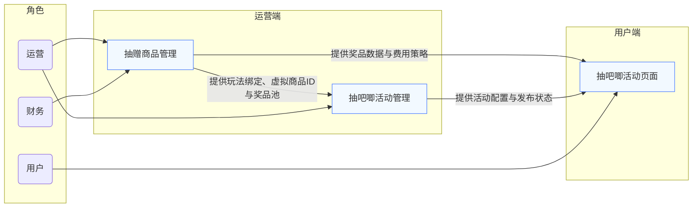

# 营销工具-新增抽赠商品 PRD v1.0

## 1. 项目信息与版本记录
- **产品名称**：营销工具 - 新增抽赠商品
- **版本**：v1.0
- **负责人**：林长宇
- **创建时间**：2026-04-26

### 版本迭代记录
| 版本 | 日期 | 变更项 | 负责人 |
| --- | --- | --- | --- |
| v1.0 | 2026-04-26 | 初始版本，完成需求确认与设计方案初稿 | 林长宇 |

## 2. 需求背景与目标
### 2.1 背景与痛点
当前营销活动中，抽赠玩法的实物奖品管理流程不统一：
- 不同活动类型（如抽吧唧、抽奖）在奖品配置、审核和发放环节上存在分散处理
- 部分活动通过优惠券作为奖品，导致用户交互流程变长、奖品体验不一致
- 缺少统一的奖品商品池管理和营销费用策略配置入口，导致运营与财务协同成本高

### 2.2 目标
通过新增抽赠商品管理能力，建立统一的奖品商品池与营销费用策略配置体系，使不同玩法类型共享一套奖品审批与费用配置流程。

### 2.3 业务目标
- 支持运营快速配置抽赠玩法的奖品商品池
- 支持财务针对奖品成本价和抽赠方式进行审核
- 统一不同玩法的奖品管理与营销费用参数配置
- 让实体商品奖品以在售商品形态规范管理，避免优惠券奖品的流程混乱

## 3. 用户与场景
### 3.1 核心用户
- **运营人员**：负责活动玩法绑定、奖品池配置和商品导入
- **财务人员**：负责审核奖品成本价与抽赠方式，决定后续营销费用策略
- **活动产品经理**：负责活动玩法联动与奖品暂存逻辑

### 3.2 典型场景
1. 运营在后台创建活动玩法时，为玩法绑定虚拟商品ID并配置对应奖品商品池
2. 运营通过输入商品ID或批量导入/Excel导入方式，将奖品商品导入商品库
3. 导入后，运营需要调整商品 SKU 的活动库存和告警库存，并选择是否启用告警
4. 财务审核奖品成本价与抽赠方式，确定项目的营销费用策略参数
5. 活动类型统一使用本产品配置的奖品商品池与费用策略参数，实现通用流程管理

### 3.3 系统架构和流程

本节说明运营、财务、用户三类角色与三个产品模块之间的关系，明确“抽赠商品管理”“抽吧唧活动管理”“抽吧唧活动页面（另行规划）”三者的职责与交互边界。

#### 3.3.1 角色与模块关系表

| 角色 | 抽赠商品管理 | 抽吧唧活动管理 | 抽吧唧活动页面（另行规划） |
| --- | --- | --- | --- |
| 运营 | 创建/编辑抽赠商品配置，绑定玩法与虚拟商品ID，导入奖品商品池，配置库存与告警，选择费用策略 | 查看活动列表的玩法绑定与费用策略，确认活动状态和关联配置 | 无直接访问；使用由活动页面提供的玩法入口和奖品展示，活动内容由另行规划的页面团队设计 |
| 财务 | 审核奖品成本价与抽赠方式，确认费用策略参数，审核结果返回运营 | 查看活动级别的关联策略和审核结果，评估活动成本与可上线状态 | 不直接参与页面交互，但其审核结果决定活动页面是否可正常开放及费用计算参数 |
| 用户 | 无直接访问；其奖品体验依赖抽赠商品池与费用策略配置 | 无直接访问；其玩法行为依赖抽吧唧活动管理传递的玩法设置 | 访问抽吧唧活动页面参与抽奖，展示玩法与奖品说明；抽奖结果与奖品发放逻辑由活动玩法系统处理 |

#### 3.3.2 产品模块职责与关系

| 产品模块 | 主要职责 | 对其它模块的依赖 |
| --- | --- | --- |
| 抽赠商品管理 | 统一抽赠奖品商品池配置、商品导入、库存与告警配置、费用策略参数设置 | 为抽吧唧活动管理提供玩法绑定、虚拟商品ID、费用策略模板和奖品池数据；为抽吧唧活动页面提供后台奖品数据和费用参数依据 |
| 抽吧唧活动管理 | 管理抽吧唧活动列表、玩法关联、状态与活动级参数展示 | 读取抽赠商品管理的配置，展示活动当前的玩法绑定与费用策略；输出活动配置给抽吧唧活动页面 |
| 抽吧唧活动页面（另行规划） | 提供用户端抽吧唧玩法入口、抽奖交互和结果展示 | 依赖抽吧唧活动管理传递的玩法配置及抽赠商品管理的奖品池与费用策略数据 |

#### 3.3.3 关系流程图

## 4. 产品范围
### 4.1 运营后台

#### 4.1.1 运营后台-营销管理-抽赠商品管理模块

- 基本设置
    - 玩法绑定与玩法虚拟商品ID设置
    - 营销费用策略参数配置（单选项，默认项目：0元赠送，按销售价计算营销费用）
    - 告警启用开关配置（默认不启用）
- 奖品商品池管理
    - 奖品商品池配置与商品导入管理
    - 批量导入/Excel导入操作入口展示与导入后校验
    - 奖品商品 SKU 的活动库存与告警库存配置

#### 4.1.2 运营后台-营销管理-抽吧唧活动管理模块

- 抽吧唧活动管理
    - 仅展示活动列表中相关参数：
        - 玩法绑定的虚拟商品ID
        - 费用策略参数（默认项目：0元赠送，按销售价计算营销费用）

### 4.2 本产品不负责范围
- 活动玩法本身的抽赠方式分类设计
- 寄存柜页面展示与用户下单发货流程
- 奖品暂存过期后的删除或清理逻辑
- 活动级别的最终发货与售后流程

## 5. 功能清单
### 5.1 页面形态与操作入口
#### 5.1.1 运营后台-营销管理-抽赠商品管理模块
#### 5.1.1.1 抽赠商品管理列表页
- 入口位置：运营后台 > 营销管理 > 抽赠商品管理
- 页面模块：
    - 抽赠商品列表展示：活动名称/玩法/费用策略/归属部门/归属营销活动/提报人/活动时间/活动审核/商品审核/操作等关键信息
      - 活动时间（上面是开始时间，下面是结束时间，时分秒级展示）
      - 商品审核展示已上线商品数量，待审核商品数量
    - 操作按钮：
      - 单独的新增按钮
      - 列表中的编辑、递交审核/撤回审核/审核/启用/停用、复制
    - 筛选条件：项目/玩法/状态

#### 5.1.1.2 抽赠商品管理添加弹层
- 入口位置：运营后台 > 营销管理 > 抽赠商品管理 - 新增
- 页面模块：
  - 基本配置（上半区）
    - 活动名称：输入活动名称
    - 玩法绑定：选择活动玩法，单选
        - 默认项目：抽吧唧活动
        - 抽福袋活动
    - 虚拟商品ID：支持多个虚拟商品ID，支持输入ID下拉搜索选择框添加
    - 费用策略：选择活动使用的策略，单选
        - 0元赠送-按销售价计算营销费用 （默认项目）
        - 关联虚拟订单合并计算营销费用
    - 归属部门：选择活动归属部门，单选
    - 归属营销活动：选择活动归属营销活动，单选
    - 活动起止时间：选择活动开始时间和结束时间，到时分秒级
    - 可叠加营销工具：选择活动可叠加的营销工具，多选
      - 优惠券
      - 支付有礼
    - 告警设置：是否启用告警开关，默认关闭
  - 商品信息（下半区）
    - 商品列表：支持输入商品ID下拉搜索选择框添加，展示已添加的商品ID、SKU、商品名称、成本价、活动库存、告警库存、告警状态等信息
    - 批量操作：批量设置活动库存和告警库存，批量启用/关闭告警
    - 导入操作：支持批量导入/Excel导入方式添加商品（本方案中仅示意）
  - 保存与取消按钮
- 目标：支持运营完成玩法绑定与项目级费用、告警的基础配置

#### 5.1.2 运营后台-营销管理-抽吧唧活动管理模块

#### 5.1.2.1 抽吧唧活动列表页
- 入口位置：运营后台 > 营销管理 > 抽吧唧活动
- 页面模块：
    - 活动列表展示：活动名称/虚拟商品ID/活动状态/开始时间/结束时间/操作等关键信息展示
    - 操作按钮：编辑、启用/停用
    - 筛选条件：活动名称/虚拟商品ID/状态
- 目标：支持运营查看玩法活动列表

### 5.2 关键数据字段
| 字段 | 说明 | 是否必填 | 备注 |
| --- | --- | --- | --- |
| 项目 ID | 活动项目唯一标识 | 是 | 关联活动/玩法 |
| 活动名称 | 活动项目内部名称 | 是 | 关联活动/玩法 |
| 玩法类型 ID | 活动玩法唯一标识 | 是 | 玩法维度配置入口 |
| 虚拟商品 ID | 玩法绑定的虚拟商品ID | 是 | 对应玩法中的虚拟奖品标识 |
| 商品 ID | 实物商品在商品库中的 ID | 是 | 导入或选择来源 |
| SKU | 商品 SKU | 是 | SKU 级别库存配置 |
| 成本价 | 财务审核成本价 | 是 | 用于费用策略参数 |
| 活动库存 | 当前活动可用库存 | 是 | 导入后需设置 |
| 告警库存 | 低库存阈值 | 否 | 只有启用告警时生效 |
| 是否启用告警 | 当前商品是否启用告警 | 否 | 开关默认关闭 |
| 费用策略模板 | 营销费用策略参数选择 | 是 | 默认项目模板 |

## 6. 关键流程
### 6.1 奖品商品池配置流程
1. 运营进入抽赠商品管理列表页新增或编辑活动配置
2. 选择玩法类型，绑定对应的虚拟商品ID，选择营销费用计算策略
4. 选择是否启用告警
3. 选择单个商品ID导入或批量导入/Excel导入
5. 运营按商品批量设置活动库存与告警库存
6. 保存后递交审核，进入财务审核环节

### 6.2 财务审核流程
1. 财务查看待审核奖品列表
2. 审核奖品成本价和抽赠方式
3. 审核通过后，项目默认使用当前费用策略模板
4. 审核未通过时，退回运营修改

## 7. 设计原则与约束
- 统一奖品商品池与费用策略配置，避免不同玩法各自孤立维护
- 以“商品库实物奖品”为核心，不再以内购券/优惠券作为主要奖品形式
- 玩法维度一套虚拟商品ID对应一组奖品池，保障配置关联清晰
- 费用策略仅参数配置，具体费用计算逻辑可由后续业务线使用该参数实现

## 8. 需求确认点
- 玩法绑定与虚拟商品ID是否按当前产品需求仅一套对应关系
- 批量导入过程中是否允许“导入结果预览与修正”
- 告警启用开关功能是否仅做配置字段，不包含实际通知逻辑
- 项目费用策略是否确认仅一套模板且默认值如上

## 9. 后续输出计划
1. 根据确认意见补充并完善 PRD 细化设计
2. 生成对应的 HTML 浏览文档
3. 设计奖品池配置与导入操作的界面原型
4. 输出流程图与数据字段说明
