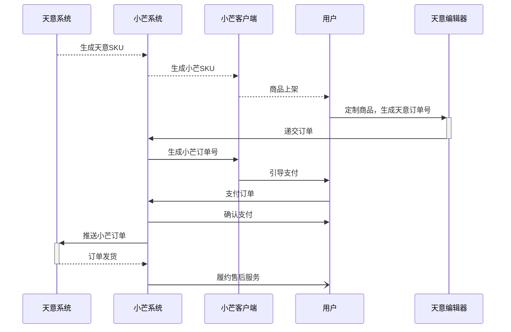

# PRD v1.0 — 创新商品工具 · 天意定制

## 项目基本信息

| 项目信息 | 内容 |
|---------|------|
| 项目名称 | 创新商品工具 - 天意定制 |
| 版本 | v1.0 |
| 状态 | 需求评审中 |
| 负责人 | 林长宇 |
| 创建时间 | 2026-06-18 |
| 产品范围 | 小芒商城天意定制IP票根商品接入、订单同步、后台发货登记 |
| 参考文档 | <a href="prd_v1.0.html" target="_blank">PRD文档</a>  <a href="../prototype_html/admin_prototype_v1.0.html" target="_blank">后台原型</a>  <a href="../prototype_html/app_prototype_v1.0.html" target="_blank">App原型</a> |

## 版本迭代记录

| 版本 | 日期 | 变更项 | 负责人 |
|-----|------|--------|--------|
| v1.0 | 2026-06-18 | 初始版本创建，完成需求收集与 PRD 文档编写 | 林长宇 |

---

## 一、需求背景与目标

### 1.1 背景与痛点
小芒商城需接入天意定制周边供应商，支持IP票根类定制商品的在线编辑与下单，构建定制商品从下单到天意生产的闭环。

### 1.2 业务目标

| 目标类型 | 描述 | 衡量指标 | 目标值 |
| --- | --- | --- | --- |
| 上线可用性 | 支持天意定制IP票根商品在小芒平台下单并同步至天意进行生产 | 接入链路通畅率 | 99% |
| 业务闭环 | 小芒下单→支付→同步给天意→天意发货登记 | 同步成功率（订单） | ≥99% |
| 用户体验 | 用户能在订单确认页看到定制预览图和最终价格并完成支付 | 定制提交→支付转化率 | ≥70% |
| 运营效率 | 运营可在后台人工录入并关联天意SKU完成商品上架 | 后台配置成功率 | ≥98% |

---

## 二、用户与场景

### 2.1 目标用户

| 用户 | 场景 |
|------|------|
| 运营人员 | 后台配置天意定制商品并关联天意SKU |
| 小芒App用户 | 商品详情页点击定制，进入天意H5并支付 |

### 2.2 使用场景

- **运营与天意对接**：在后台新增/关联定制商品，配置制作周期和预计发货天数
- **用户定制**：在商品详情页点击"定制"，跳转天意H5编辑器完成定制并返回小芒订单确认页支付

### 2.3 核心用户旅程（User Journey Map）

| 阶段 | 触点 | 行为 | 痛点/情绪 | 机会点 |
|------|------|------|-----------|--------|
| 配置 | 后台 | 运营录入关联天意SKU、制作周期 | 配置易错 | 提供校验与说明 |
| 发现 | 商品列表/详情 | 看到可定制商品 | 需清晰说明定制不可退、制作周期 | 在详情页及确认页展示不可退声明与制作周期 |
| 定制 | 商品详情页 | 点击定制进入H5 | 担心订单链路是否通畅 | 引导说明不可退及价格一致 |
| 编辑 | 天意H5编辑器 | 在H5内完成定制内容并生成定制生产订单 | 用户担心预览与最终成品差异 | 在确认页展示定制预览图并保存到订单记录 |
| 支付 | 订单确认页 | 查看预览图并支付 | 需确认定制内容、确保价格一致 | 展现预览图、最终价格、不可退款声明 |
| 同步 | 订单系统 | 支付后同步给天意 | 同步失败风险 | 重试+告警机制 |
| 发货 | 商家后台 | 录入物流单号 | 需核对生产单号 | 展示天意定制生产订单号 |

---

## 三、产品范围

### 3.1 商家后台
- 商品管理（新建天意定制商品类型，关联天意SKU字段，SPU级别配置制作周期/预计发货天数）
- 发货登记（填写物流单号，显示天意定制生产订单号）

### 3.2 小芒App
- 商品详情页：确认不可退声明后跳转天意H5编辑器
- 订单确认页：展示最终价格

### 3.3 订单系统
- 支持将已支付订单同步给天意
- 记录天意返回的生产订单号
- 发货登记由运营在后台人工录入物流单号（已有功能）

### 3.4 接口
- 用户昵称接口（实现用户昵称显示和定制内容数据）
- 订单同步接口（支付后同步给天意并记录生产订单号）

### 3.5 天意编辑器（第三方研发）
- 支持用户在H5内完成定制内容并生成定制生产订单
- 提供定制预览图展示定制内容，确认后提交订单至小芒

---

## 四、功能清单

### 4.1 功能清单

| 功能 | 描述 | 优先级 | 标识 |
|------|------|--------|------|
| 商品管理 | 商家后台关联天意SKU、配置制作周期 | P0 | `admin_feature_01` |
| 用户昵称接口 | 实现用户昵称显示和定制内容数据 | P0 | `api_01` |
| 商品详情页定制入口 | 跳转天意H5编辑 | P0 | `app_feature_01` |
| 订单确认页摘要 | 展示预览图、最终价格、不可退款声明 | P0 | `app_feature_02` |
| 订单同步接口 | 支付后同步给天意并记录生产订单号 | P0 | `api_02` |
| 发货登记 | 商家后台录入运单号并显示天意定制生产订单号 | P1 | `admin_feature_02` |

### 4.2 基础业务规则
1. 只有在用户完成天意H5编辑并返回小芒订单确认页且用户支付成功后，才会触发订单同步给天意
2. 由天意供应商提供H5编辑器，编辑完成后在天意侧生成"天意定制生产订单号"
3. 同步接口需幂等，支持重复提交的幂等处理（基于小芒订单号或天意定制生产订单号）
4. 商家后台发货登记必须填写运单号以完成发货流程；发货时后台显示天意定制生产订单号供核对
5. 定制商品在订单上标注"不可退款"，退款仅在极特殊运营场景下由人工处理

### 4.3 业务流程图

---

## 五、详细方案

### 5.1 Admin（商家后台）

#### 5.1.1 商品管理（admin_feature_01）
- 运营在后台新增/编辑商品时，录入关联天意SKU并配置制作周期/预计发货天数
- 该字段为人工一对一录入
- 一期仅IP票根定制

#### 5.1.2 发货登记（admin_feature_02）
- 运营在后台填写运单号完成发货登记，系统显示天意定制生产订单号供核对

| 异常场景 | 处理方案 |
|---------|---------|
| 发货登记空状态 | 展示"请先填写运单号完成发货"的提示 |

### 5.2 App（小芒客户端）

#### 5.2.1 商品详情页定制入口（app_feature_01）
- 详情页展示"定制"按钮，点击跳转天意H5编辑器，返回后进入小芒订单确认页

#### 5.2.2 订单确认页摘要（app_feature_02）
- 展示定制预览图、最终价格及不可退款声明，并将定制项目编号/昵称保存到订单扩展字段

### 5.3 API（系统接口）

#### 5.3.1 用户昵称接口（api_01）
- 天意编辑器调用，实现用户昵称显示和定制内容数据
- 接口参数待确认

#### 5.3.2 订单同步接口（api_02）
- 支付完成后同步订单给天意，字段包括：小芒订单号、天意定制生产订单号、支付时间
- 接口需支持幂等与重试告警
- 接口参数待确认

| 异常场景 | 处理方案 |
|---------|---------|
| 同步接口超时/失败的降级方案 | 飞书告警 |

---

## 六、商品&订单核心逻辑

### 6.1 玩法定义与目标对齐

- 玩法定义：天意定制属于"第三方定制商品"的合作型营销。
- 核心链路：合作上线定制商品 → 用户购买天意定制商品 → 同步订单到合作方系统 → 合作方生产发货 → 小芒平台提供售后服务。

### 6.2 商品体系架构设计
- 新增商品类型：新增“天意定制”专属类型
  - 配置要求
    - 商品类型：实物商品
    - 规格限制：多规格
    - 不能加购：强制
    - 不支持搜索：不强制
    - 半屏支付：不支持
  - 测试环境商品类型ID：145
  - 线上环境商品类型ID：126
- 商家/供应商后台配置：
  - 配置第三方关联信息：天意关联SKU、制作周期、预计发货天数（已有）
- 前端展示规范：
  - 商品详情页展示逻辑
    - 参考印鸽定制商品详情页
    - 确认协议后跳转天意H5编辑器

### 6.3 营销活动与费用策略配置
- 天意定制商品
  - 优惠支持：天意定制商品支持使用（平台优惠券/自营优惠券，优惠方式：固定-减免）、“满立减-满减”营销活动。
  - 前端标签规范：
    - 参与满减活动时，需根据具体玩法展示对应标签：
      - 涉及金额减免（满X元减Y元 / 满X件减Y元）：统一展示【限时减x元】
      - 涉及折扣或一口价（满X件Y折 / X件Y元）：统一展示【限时xx折】
    - 参与优惠券活动时，展示对应标签：【限时减x元】
- 付邮购玩法支持
  - 支持升款：需要重点测试
  - 营销工具互斥：商品可加入付邮购活动，与其他优惠互斥

### 6.4 订单流程与状态机设计
- 天意定制商品下单：支付超时15分钟（默认）自动取消订单
- 订单来源标识：需要支持透传订单来源渠道和来源标识（source_channel\source_id\trans_from\trans_from_id）。
- 我的订单：天意定制商品订单在我的订单中（【全部订单】）展示；

### 6.5 售后链路
- 独立售后链路：针对“天意定制商品”，执行独立的售后流程：
  - 待支付状态：默认15分钟待支付超时限制
    - 列表卡片按钮（默认）：取消订单、去支付
    - 订单详情（默认）：取消订单、去支付
  - 待发货状态：不支持退款，前端需隐藏订单详情页的“申请退款”入口。
    - 列表卡片按钮：提醒发货、查看订单
    - 订单详情：不显示底部按钮（隐藏）
  - 待收货状态：支持常规“申请售后”流程（如退货/换货）。
    - 列表卡片按钮：查看物流、确认收货
    - 订单详情：不显示底部按钮（隐藏）
  - 待评价、已完成状态等：
    - 列表卡片按钮：删除订单
    - 订单详情：不显示底部按钮（隐藏）
  - 售后服务功能点：
    - 只保留"申请补寄"功能
    - 售后服务功能点 暂不开放"我要退货退款"和"我要退款（无需退货）"

### 6.6 财务数据关联与对账
- 无

---

## 七、监控与埋点

（本期略）

---

## 八、未来演进

（本期略）

---

## 九、附件

### 9.1 原始需求文档
- 解决方案讨论稿： https://u0t1gqhnrt.feishu.cn/wiki/Mb0kw4USFiiWjPk1pShceaelnce

### 9.2 会议纪要
- 2026-6-15 : https://u0t1gqhnrt.feishu.cn/docx/TqY6dkNgXo1juFxVYxichQ0QnVc

---