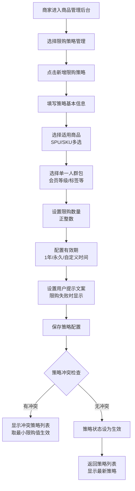
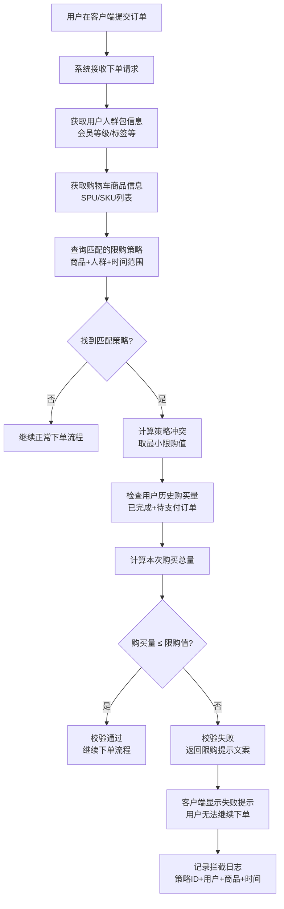

# 商品限购策略 PRD v1.0

## 1. 项目信息与版本记录
- 产品名称：商家后台商品限购策略
- 版本：v1.0
- 负责人：林长宇
- 创建时间：2026-03-27

### 版本迭代记录
| 版本 | 日期 | 变更项 | 负责人 |
| --- | --- | --- | --- |
| v1.0 | 2026-03-27 | 初版需求确认与策略模型定义 | 林长宇 |

## 2. 需求背景与目标
### 2.1 背景与痛点
商家活动期出现以下问题：
- 限量商品（独特门票礼包/SPU）会被超级用户多次抢购导致普通用户无法购买；
- 现有系统未提供可配置的人群包限购策略，无法做到个性化限购；
- 规则管理零散（促销/商品模块无法覆盖限购冲突与精细化控制），导致支持成本高。

### 2.2 业务目标
| 目标类型 | 描述 | 衡量指标 | 目标值 |
| --- | --- | --- | --- |
| 业务稳定 | 限购规则零误判 | 限购相关拦截错误≤0 | 0 | 
| 体验风险 | 用户下单失败提示明确 | 相关提示正确率≥99% | 99% | 
| 活动控制 | 避免超卖/抛单 | 有效库存一致性≥99.9% | 99.9% |

## 3. 用户与使用场景
### 3.1 核心用户
- 商家运营后台人员（策略配置者）
- 商品管理后台管理员

### 3.2 典型场景
1. 运营在商品管理中创建“人群包策略”和“限购策略”。
2. 指定单个 SPU 或 SKU（可多选）进行限购。
3. 选择单一人群包（会员等级/标签等），配置限购数量及有效期（到秒）。
4. 客户端下单阶段，系统校验当前策略；若规则不满足则拒单并返回策略配置提示。

### 3.3 核心用户旅程
| 阶段 | 用户触点 | 用户行为 | 痛点/情绪 | 产品机会 |
| --- | --- | --- | --- | --- |
| 策略配置 | 商品管理-限购策略 | 复制、配置商品、选择人群包 | 期望易用，避免错配 | 提供模板、智能校验 |
| 策略生效 | 下单校验 | 触达限购提示、被拒单 | “不清楚为什么失败” | 提供策略命中详情 |
| 持续优化 | 策略管理 | 查看历史、调整策略 | 冲突策略难判定 | 冲突分析/最小值执行展示 |

## 4. 需求功能清单

### 4.1 商家后台模块1：人群包策略管理
- 人群包加入条件：支付完成、签收完成、订单完成任选；动态人群
- 指定商品：支持指定SPU/SKU，支持多个，一行一个输入
- 初始化：过去365天历史购买用户；退款剔除由其他系统实现，本产品提供开关

### 4.2 商家后台模块2：限购策略管理
- 单策略仅支持单一人群包（多策略可覆盖不同人群）。
- 仅支持指定 SPU/KSU（多选）。
- 冲突规则：若多条策略同时命中，取最小限购值；任意一个策略不满足即拒单（严格执行）。
- 有效期选项：1年/永久/自定义（到秒）。
- 下单环节校验，提示来自策略配置字段。

### 4.3 APP商品详情页面
- 校验点：下单环节（最接近交易核心）。
- 若限购策略命中，校验条件：当前用户与商品是否满足策略的SPU/SKU与人群包；购买数量≤策略限购；在生效期内。
- 失败处理：返回“策略提示文案”，阻断流程；并记录拦截日志（含策略ID、人群包、商品、时间）。

## 5. 详细方案
### 5.1 商家后台模块1：人群包策略管理
- 商品中心新增模块名称：人群包策略
- 列表展示：策略ID、人群包、商品范围（SPU/SKU）、加入条件、状态。
- 新增/编辑页面：
  * 人群包名称：为必填项。
  * 绑定商品：SPU限购/SKU限购
  * 批量ID：多个商品ID/多个SKU ID
  * 加入条件：支付完成、签收完成、订单完成单选
  * 是否回溯：是否回溯指定时间段内购买记录，注明365天内购买用户
  * 状态：启用/禁用

### 5.2 商家后台模块2：限购策略管理
- 商品中心新增模块名称：限购策略
- 列表展示：策略ID、名称、商品范围（SPU/SKU）、限购数量、有效期、提示文案、状态。
- 新增/编辑页面：
  * 选择类别：SPU限购/SKU限购
  * 指定商品ID：单个商品ID
  * 如果类别为SKU限购，展示SKU列表勾选界面
  * 选择人群包（精确单选）。默认不指定。
  * 限购数量：正整数。
  * 有效期：1年/永久/自定义（到秒）。
  * 冲突策略：自动说明“与当前策略同时命中时将取最小值”。
  * 提示文案：可设置单条自定义文案。

### 5.3 APP商品详情页面
- 下单流程：
  1. 读取购物车待下单商品、用户人群包规格。
  2. 过滤策略：商品命中策略集、人群包匹配、生效期内。
  3. 策略冲突：筛选符合的多策略，取限购值最小，作为用户可买上限。
  4. 校验购买数量（含已下单+待支付历史）是否超限；若超限则返回主动提示并拒绝。

## 6. 业务流程图

### 6.1 后端配置流程

### 6.2 用户下单校验流程

## 7. 异常与边界处理
- 非法时间范围（开始>=结束）禁止保存策略。
- 人群包为空或多选时（不支持），阻止提交并提示。
- 单策略限购数<=0或超阈值（例如9999）校验。
- 下单时策略失效/过期：重新计算并提示“当前策略已失效，请刷新重试”。

## 8. 数据追踪与埋点
- `event_strategy_view`：策略列表访问
- `event_strategy_change`：人群包策略/限购策略新增编辑
- `event_order_limit_hit`：限购拦截（含策略ID）
- `event_order_limit_pass`：下单校验通过

## 9. 未来演进规划
- 支持导入/导出策略模板（CSV/JSON）；
- 增加策略“模拟鉴权”功能；
- 支持跨店铺共享策略与权限控制；
- 支持“策略优先级”、并发下单极限保护（分布式锁）。

## 10. 附件
- 数据字典/示例策略模板（待补充）
