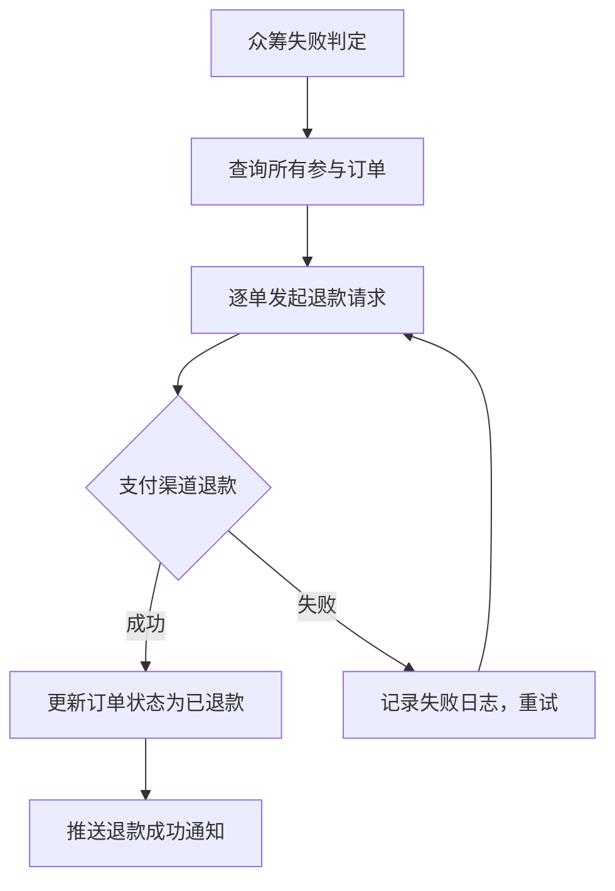
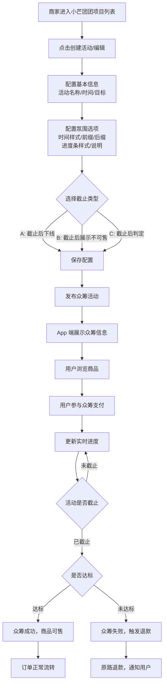

# PRD - 商家后台：小芒团团营销工具升级支持众筹玩法

## 项目基本信息

| 字段 | 内容 |
|------|------|
| 项目名称 | 商家后台-小芒团团营销工具升级支持众筹玩法 |
| 版本 | v1.0 |
| 负责人 | 产品经理（待确认） |
| 创建时间 | 2026-04-13 |
| 更新时间 | 2026-04-13 |
| 状态 | 初稿评审中 |

---

## 版本记录

| 版本 | 日期 | 修改人 | 修改类型 | 修改说明 |
|------|------|--------|---------|----------|
| v1.0 | 2026-04-13 | Qwen | 新增 | 初始版本，新增众筹玩法配置功能 |

---

## 一、需求背景

### 1.1 现状问题

当前小芒团团营销工具仅支持**单一团购玩法**，无法满足商家对众筹营销场景的需求。众筹玩法的核心差异在于：
- 需要设定目标（金额/件数），达标后商品才会生产/发货
- 未达标需触发退款流程
- 需要展示众筹进度、氛围等专属信息

### 1.2 需求必要性

- **商家侧**：丰富营销工具，降低试错成本（未达标不生产）
- **平台侧**：提升商品多样性和用户参与度，增强平台竞争力
- **用户侧**：以更低价格参与众筹，获得实惠

---

## 二、需求目标

| 目标类型 | 描述 | 衡量指标 | 目标值 |
|----------|------|----------|--------|
| 业务目标 | 商家可在小芒团团营销工具中配置众筹玩法 | 众筹活动创建成功率 | ≥95% |
| 用户体验 | App端展示众筹进度、目标、已购人数等信息 | 众筹商品详情页转化率 | 提升 10% |
| 技术目标 | 实现实时状态切换逻辑 | 状态切换延迟 | ≤500ms |

---

## 三、用户与使用场景

### 3.1 典型用户

| 用户角色 | 描述 | 核心诉求 |
|----------|------|----------|
| 商家运营人员 | 负责在商家后台配置营销活动 | 快速配置众筹玩法，灵活控制活动策略 |
| App 消费者 | 浏览商品并参与众筹 | 清晰了解众筹进度、目标、规则，便捷参与 |

### 3.2 用户旅程图 (User Journey Map)

#### 商家侧旅程

| 阶段 | 用户触点 | 用户行为 | 痛点/情绪 | 产品机会点 |
|------|----------|----------|-----------|------------|
| 发现入口 | 商家后台-小芒团团项目列表 | 点击"创建/编辑活动" | 担心找不到新配置项 | 清晰标识"氛围配置"入口 |
| 配置策略 | 氛围配置弹窗 | 配置时间/进度条样式、选择截止类型 | 配置项较多，易遗漏 | 提供默认值，按需展开 |
| 发布活动 | 确认提交 | 保存并发布众筹活动 | 担心配置错误 | 提供配置预览 |
| 监控进度 | 活动管理列表 | 查看众筹进度、状态 | 关注是否达标 | 实时进度展示 + 状态提醒 |

#### 用户侧旅程

| 阶段 | 用户触点 | 用户行为 | 痛点/情绪 | 产品机会点 |
|------|----------|----------|-----------|------------|
| 浏览商品 | App 商品详情页 | 查看众筹商品详情 | 担心众筹是否可信 | 展示进度、已购人数增强信任 |
| 了解规则 | 众筹信息区 | 阅读目标金额/件数、截止时间 | 不理解未达标如何处理 | 清晰标注退款规则 |
| 参与众筹 | 点击"立即参与" | 选择规格、支付 | 支付流程复杂 | 简化参与路径 |
| 等待结果 | 订单详情页 | 查看众筹进度、状态 | 焦虑等待 | 实时推送进度更新 |
| 结果通知 | 系统通知 | 收到众筹成功/失败通知 | 成功喜悦/失败失落 | 失败时推荐类似活动 |

---

## 四、需求功能清单


### 4.1 商家后台

| 功能标识 | 功能名称 | 产品形态 | 优先级 | 描述 |
|----------|----------|----------|--------|------|
| `admin_activity_list` | 小芒团团活动列表 | 商家后台 | P0 | 列表展示已创建的活动，提供 创建、编辑、氛围配置、下线 操作 |
| `admin_activity_list_popup_info` | 基本配置项 | 商家后台 | P0 | 活动名称、开始时间、截止时间、众筹目标类型、众筹目标值 |
| `admin_activity_list_popup_extra` | 氛围配置项 | 商家后台 | P0 | 分享卡片图片、展示渠道（APP、M站、小程序）、达标即发货（开启/关闭）、时间样式/前缀/后缀、进度条前缀/说明、进度条样式、活动截止类型配置 |


### 4.2 App：商品详情页

| 功能标识 | 功能名称 | 产品形态 | 优先级 | 描述 |
|----------|----------|----------|--------|------|
| `app_goods_details_status_running` | App 端众筹信息展示区（进行中） | App | P0 | 活动未截止且未达标时的进度展示 |
| `app_goods_details_status_success` | App 端众筹信息展示区（成功） | App | P0 | 活动已截止且达标时的成功状态展示 |
| `app_goods_details_status_fail` | App 端众筹信息展示区（失败） | App | P0 | 活动已截止且未达标时的失败状态展示 |
| `app_goods_details_status_end` | App 端众筹信息展示区（已结束） | App | P0 | 活动截止类型为 A/B 时的已结束状态展示 |


### 4.3 交易系统模块

| 功能标识 | 功能名称 | 产品形态 | 优先级 | 描述 |
|----------|----------|----------|--------|------|
| `system_status_switch` | 实时状态切换 | 系统 | P0 | 截止时实时根据进度判定活动状态 |
| `system_refund_logic` | 未达标退款逻辑 | 系统 | P0 | 众筹未达标自动触发退款 |

---

## 五、详细方案

### 5.1 商家后台：小芒团团活动列表

**功能标识**: `admin_activity_list`

#### 前置条件
- 商家已开通小芒团团营销工具权限
- 商家已登录商家后台

#### 核心逻辑
1. 展示商家已创建的所有小芒团团活动列表
2. 列表字段包含：活动名称、玩法类型（单品团购/众筹）、截止时间、当前进度、状态、操作
3. 提供操作按钮：创建活动、编辑、氛围配置、下线
4. 玩法类型标签区分：
   - 单品团购：绿色标签
   - 众筹：蓝色标签

#### 数据流向
```
后端查询活动列表 → 前端渲染表格 → 商家操作（创建/编辑/下线） → 提交后端更新
```

#### 交互逻辑
- 点击"创建活动"：打开团购配置弹窗
- 点击"编辑"：打开团购配置弹窗，回显当前活动配置
- 点击"氛围配置"：打开氛围配置弹窗
- 点击"下线"：二次确认后下线活动

---

### 5.2 商家后台：基本配置项

**功能标识**: `admin_activity_list_popup_info`

#### 前置条件
- 商家点击"创建活动"或"编辑"按钮

#### 核心逻辑
1. 在团购配置弹窗中展示基本配置项
2. 配置项清单：

| 配置项 | 类型 | 必填 | 默认值 | 说明 |
|--------|------|------|--------|------|
| 活动名称 | 文本输入 | 是 | 空 | 活动名称，用于列表展示 |
| 开始时间 | 日期时间选择器 | 是 | 当前时间 | 活动开始时间 |
| 截止时间 | 日期时间选择器 | 是 | 当前时间 + 7天 | 活动截止时间 |
| 众筹目标类型 | 下拉选择 | 是（众筹玩法） | 按金额 | 按金额 / 按件数 |
| 众筹目标值 | 数字输入 | 是（众筹玩法） | 空 | 目标金额或件数 |

#### 交互逻辑
- 活动名称：限制 50 字以内
- 开始时间 ≤ 截止时间
- 选择众筹玩法时，必须配置众筹目标

---

### 5.3 商家后台：氛围配置项

**功能标识**: `admin_activity_list_popup_extra`

#### 前置条件
- 商家在团购配置弹窗中选择"众筹"玩法

#### 核心逻辑
1. 选择"众筹"玩法后，展开氛围配置区
2. 配置项清单：

| 配置项 | 类型 | 默认值 | 说明 |
|--------|------|--------|------|
| 分享卡片图片 | 图片上传 | 系统默认图片 | 众筹活动分享时的封面图片 |
| 展示渠道 | 多选 | APP、M站、小程序（全选） | 选择众筹活动展示的渠道 |
| 达标即发货 | 开关 | 关闭 | 开启后，达标后立即安排发货（无需等待截止） |
| 时间样式 | 下拉选择 | `MM-DD HH:mm - MM-DD HH:mm`、`YYYY-MM-DD HH:mm`、`倒计时` | 自定义时间展示格式 |
| 时间前缀 | 文本输入 | 空 | 如"距结束"、"剩余"等 |
| 时间后缀 | 文本输入 | `结束` | 时间后的补充说明（可选） |
| 进度条样式 | 单选 | `B: 众筹` | A: 团购样式 / B: 众筹样式 |
| 进度条前缀 | 文本输入 | `已销售` | 如"已筹"、"已完成"等 |
| 进度条说明 | 文本输入 | 根据团购策略生成 | 动态生成进度说明文案 |
| 活动截止类型 | 单选 | `C: 截止后根据目标判定` | A/B/C 三种类型 |

#### 进度条样式选项

| 选项 | 名称 | 视觉效果 |
|------|------|----------|
| A | 团购 | 绿色渐变进度条 |
| B | 众筹 | 橙色渐变进度条 |

#### 活动截止类型选项

| 类型 | 名称 | 逻辑说明 |
|------|------|----------|
| A | 截止后活动下线 | 原逻辑，时间到直接下线 |
| B | 截止后继续展示但不可售 | 团购长期展示，但不可购买 |
| C | 截止后根据目标判定是否可售 | **众筹专属**：达标→可售；未达标→退款 |

#### 交互逻辑
- 氛围配置区默认展开，支持收起/展开
- 所有配置项均有默认值，商家可修改
- 提供进度条实时预览
- 配置区底部展示预览效果

---

### 5.4 App 端：商品详情页 - 众筹进行中状态

**功能标识**: `app_goods_details_status_running`

#### 前置条件
- 商品为众筹类型
- 活动未截止且未达标

#### 核心逻辑
1. **替换**原有团购信息展示区为众筹信息展示区
2. 展示内容：
   - 进度条（样式根据商家配置决定）
   - 进度文案（进度条前缀 + 当前进度 + 进度条说明）
   - 目标信息（目标金额/件数，根据商家配置的目标类型展示）
   - 已购人数
   - 已购金额
   - 截止时间（时间样式 + 时间前缀 + 时间后缀）
   - 众筹规则说明（未达标退款等）

#### 进度展示逻辑

| 目标类型 | 展示文案 | 示例 |
|----------|----------|------|
| 按金额 | 已筹 ¥XXX / ¥目标金额 | 已筹 ¥12,580 / ¥20,000 |
| 按件数 | 已筹 XXX 件 / 目标 XXX 件 | 已筹 256 件 / 500 件 |

#### 数据展示区

| 字段 | 说明 |
|------|------|
| 进度百分比 | (当前进度 / 目标) × 100% |
| 已购人数 | 参与众筹的去重用户数 |
| 已购金额 | 当前累计支付金额 |
| 倒计时 | 截止时间 - 当前时间 |

#### 交互逻辑
- 点击进度条/目标信息可展开详细规则
- 支持分享众筹商品链接
- 底部展示"立即参与"按钮

---

### 5.5 App 端：商品详情页 - 众筹成功状态

**功能标识**: `app_goods_details_status_success`

#### 前置条件
- 商品为众筹类型
- 活动已截止且已达标

#### 核心逻辑
1. 展示众筹成功标识（🎉 图标 + "众筹成功！"文案）
2. 展示最终进度（100% 或超额完成）
3. 展示预计发货时间
4. 底部操作按钮变更为"立即购买"（商品可售状态）

#### 展示内容

| 字段 | 说明 |
|------|------|
| 成功标识 | 🎉 图标 + "众筹成功！" |
| 最终进度 | 已筹 ¥XXX / 目标 ¥XXX（100%） |
| 发货说明 | 预计发货时间：XXXX 年 XX 月 XX 日前 |
| 操作按钮 | "立即购买" |

---

### 5.6 App 端：商品详情页 - 众筹失败状态

**功能标识**: `app_goods_details_status_fail`

#### 前置条件
- 商品为众筹类型
- 活动已截止且未达标

#### 核心逻辑
1. 展示众筹失败标识（😔 图标 + "众筹未达标"文案）
2. 展示最终进度（未达 100%）
3. 展示退款说明
4. 底部操作按钮变更为"查看其他活动"

#### 展示内容

| 字段 | 说明 |
|------|------|
| 失败标识 | 😔 图标 + "众筹未达标" |
| 最终进度 | 已筹 ¥XXX / 目标 ¥XXX（XX%） |
| 退款说明 | 退款将在 T+1 个工作日内退回 |
| 操作按钮 | "查看其他活动" |

---

### 5.7 App 端：商品详情页 - 活动已结束状态

**功能标识**: `app_goods_details_status_end`

#### 前置条件
- 商品为众筹类型
- 活动截止类型为 A（截止后活动下线）或 B（截止后继续展示但不可售）
- 活动已截止

#### 核心逻辑
1. **类型 A（截止后活动下线）**：
   - 商品详情页不展示众筹信息区
   - 展示"活动已结束"占位图
   - 底部操作按钮隐藏或变更为"查看其他活动"

2. **类型 B（截止后继续展示但不可售）**：
   - 展示众筹信息区（进度条、目标、已购人数/金额）
   - 进度条展示为灰色（不可交互）
   - 底部操作按钮变更为"活动已结束"

#### 展示内容

| 截止类型 | 进度条 | 操作按钮 | 说明文案 |
|----------|--------|----------|----------|
| A | 隐藏 | 隐藏/查看其他活动 | "活动已结束" |
| B | 灰色禁用 | 活动已结束 | "活动已结束，感谢您的关注" |

---

### 5.8 系统：实时状态切换

**功能标识**: `system_status_switch`

#### 核心逻辑
1. 活动截止时间到达时，系统**实时**触发状态判定
2. 判定逻辑：
   ```
   if (当前进度 >= 目标) {
     状态变更为 "众筹成功"
     商品变为可售状态
     订单正常流转
   } else {
     状态变更为 "众筹失败"
     触发退款流程
   }
   ```
3. 状态变更后：
   - 更新 App 端展示状态（成功/失败/已结束）
   - 向参与用户推送系统通知
   - 更新商家后台活动列表状态

#### 状态变更通知

| 状态 | 通知内容 | 接收人 |
|------|----------|--------|
| 众筹成功 | "恭喜！您参与的众筹活动已成功，商家将尽快安排发货。" | 所有参与用户 |
| 众筹失败 | "很遗憾，众筹未达标。退款已发起，将在 T+1 个工作日内退回。" | 所有参与用户 |

---

### 5.9 系统：未达标退款逻辑

**功能标识**: `system_refund_logic`

#### 核心逻辑
1. 众筹失败后，系统**自动**触发退款
2. 退款路径：原路退回用户支付账户
3. 退款时效：T+1 个工作日内到账（依赖支付渠道）
4. 通知推送：向参与用户推送"众筹失败，已发起退款"通知
5. 订单状态：变更为"已关闭-众筹未达标"

#### 退款流程



#### 异常处理

| 异常场景 | 处理逻辑 |
|----------|----------|
| 支付渠道退款失败 | 记录失败日志，延迟 5 分钟后重试，最多重试 3 次 |
| 用户账户异常 | 联系人工客服处理 |
| 退款金额不一致 | 核对订单金额，人工介入处理 |

---

## 六、业务流程图



---

## 七、异常与边界处理

| 异常场景 | 处理逻辑 |
|----------|----------|
| 网络中断（商家提交配置时） | 提示"网络异常，请重试"，保留已填配置数据 |
| 网络中断（用户支付时） | 支付状态查询，未完成则取消订单，已完成则保留 |
| 空数据状态（App 端无众筹商品） | 展示"暂无众筹活动"空状态页，推荐普通团购商品 |
| 权限不足（商家无小芒团团权限） | 提示"您暂无权限使用此功能，请联系客服开通" |
| 库存不足（用户参与时） | 提示"库存不足"，禁止参与 |
| 重复参与（同一用户多次参与） | 按已有功能逻辑处理（需确认是否允许多次参与） |
| 商家中途修改目标/时间 | 按已有功能配置逻辑处理 |

---

## 八、数据追踪与埋点（可选）

| 埋点事件 | 触发时机 | 埋点参数 |
|----------|----------|----------|
| `crowd_config_create` | 商家创建众筹活动 | activity_id, deadline_type, progress_style |
| `crowd_page_view` | 用户浏览众筹商品详情页 | product_id, current_progress, target |
| `crowd_join_click` | 用户点击"立即参与" | product_id, user_id |
| `crowd_payment_success` | 用户众筹支付成功 | order_id, amount, product_id |
| `crowd_status_change` | 活动状态变更（成功/失败） | activity_id, status, final_progress |

---

## 九、未来演进规划（可选）

| 版本 | 规划内容 |
|------|----------|
| v1.1 | 支持阶梯目标（不同金额/件数触发不同权益） |
| v1.2 | 支持众筹活动审核流程 |
| v1.3 | 支持"延长冲刺期"功能 |
| v2.0 | 支持多人拼团 + 众筹混合玩法 |

---

## 十、附件

| 附件名称 | 说明 |
|----------|------|
| admin_config.png | 商家后台配置参考截图（待补充） |

---

> **📝 文档说明**：本文档为第一版初稿，待原型确认后补充交互细节和界面流转图。
