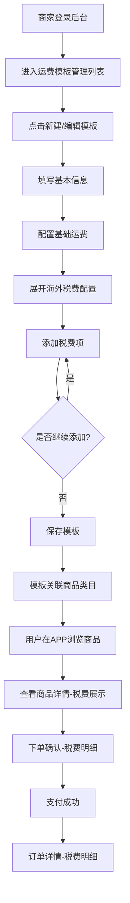

# 商家后台-升级运费模板支持海外税费 PRD v1.0

## 1. 项目信息与版本记录
- **产品名称**：商家后台-升级运费模板支持海外税费
- **版本**：v1.0
- **负责人**：林长宇
- **创建时间**：2026-04-23

### 版本迭代记录
| 版本 | 日期 | 变更项 | 负责人 |
| --- | --- | --- | --- |
| v1.0 | 2026-04-23 | 初始版本创建，完成需求收集与PRD文档编写 | 林长宇 |

## 2. 需求背景与目标
### 2.1 现状问题与痛点
目前运营团队希望在商家后台升级运费模板支持海外税费，以满足进口商品的不同运费计算需求。

现状痛点：
1. **税费无法独立计算**：目前海外税费直接加到商品价格里，无法单独管理和展示
2. **商家配置不灵活**：无法针对不同商品类目设置不同的海外税费规则
3. **用户看不到税费明细**：APP端用户无法清晰了解所支付的税费构成

### 2.2 需求提出的必要性
通过升级运费模板支持海外税费，可以实现税费与运费独立计算，支持按商品类目设置不同税费规则，APP端逐项展示税费明细。

### 2.3 业务目标
| 目标类型 | 描述 | 衡量指标 | 目标值 |
| --- | --- | --- | --- |
| 功能扩展 | 支持海外税费独立配置 | 海外税费模板配置率 | ≥80% |
| 用户体验 | 提升价格透明度 | 税费明细展示完整率 | 100% |

## 3. 用户与使用场景
### 3.1 核心用户
- **商家后台用户**：设置和管理运费模板，配置海外税费规则

### 3.2 典型场景
1. 商家进入运费模板管理列表，查看现有模板
2. 商家编辑运费模板，展开高级配置添加海外税费项
3. 商家为每项税费设置名称、计费方式、首件/续件费用
4. 用户在APP商品详情页查看税费明细
5. 用户在下单确认页核对税费总额
6. 用户在订单详情页查看税费构成

### 3.3 核心用户旅程
| 阶段 | 用户触点 | 用户行为 | 痛点/情绪 | 产品机会 |
| --- | --- | --- | --- | --- |
| 配置 | 运费模板编辑页 | 展开高级配置，添加海外税费项 | 困惑：税费如何设置？ | 提供清晰的配置引导 |
| 下单 | APP商品详情页 | 查看运费和税费明细 | 疑虑：税费怎么这么高？ | 清晰展示税费构成 |
| 支付 | 下单确认页 | 核对总费用包含税费 | 不解：税费包含哪些？ | 分项展示运费和各项税费 |

## 4. 需求功能清单
### 4.1 商家后台端功能
| 功能模块 | 功能点 | 优先级 | 功能标识 |
| --- | --- | --- | --- |
| 运费模板管理 | 展示运费模板列表，支持查看编辑 | P0 | admin_shipping_template_list |
| 运费模板编辑 | 新增/编辑模板基本信息，在原有配置基础上添加海外税费项 | P0 | admin_shipping_template_edit |

### 4.2 APP端功能
| 功能模块 | 功能点 | 优先级 | 功能标识 |
| --- | --- | --- | --- |
| 商品详情页 | 展示运费和税费明细 | P0 | app_product_detail |
| 下单确认页 | 展示运费和税费明细 | P0 | app_checkout |
| 订单详情页 | 展示运费和税费明细 | P0 | app_order_detail |

## 5. 详细方案

### 5.1 商家后台端

#### 5.1.1 运费模板管理（admin_shipping_template_list）

**功能描述**：展示运费模板列表，支持商家新建模板、编辑现有模板。

**页面结构**：
| 区域 | 内容 |
| --- | --- |
| 操作区 | 新建模板按钮 |
| 搜索筛选区 | 模板名称搜索、筛选按钮 |
| 数据表格区 | 模板列表展示 |

**数据表格字段**：
| 字段 | 说明 |
| --- | --- |
| 模板名称 | 运费模板的名称 |
| 计费方式 | 按件 / 按重量 |
| 是否独立计费 | 是 / 否 |
| 海外税费 | 已配置 / 未配置 |
| 关联类目 | 关联的商品类目数量 |
| 状态 | 启用 / 禁用 |
| 操作 | 编辑 / 禁用或启用 |

#### 5.1.2 运费模板编辑（admin_shipping_template_edit）

**功能描述**：新建或编辑运费模板，配置基础运费和海外税费。

**编辑面板（右侧滑出，宽度90%）**：

**基本信息区块**：
| 字段 | 类型 | 说明 |
| --- | --- | --- |
| 模板名称 | 输入框 | 模板名称 |
| 是否独立计费 | 下拉选择 | 是 / 否 |

**基础运费配置区块**：
| 字段 | 类型 | 说明 |
| --- | --- | --- |
| 计费方式 | 下拉选择 | 按件 / 按重量 |
| 首件/首重数量 | 数字输入 | 首件/首重的起始数量 |
| 首件/首重费用（元） | 数字输入 | 首件/首重的费用金额 |
| 续件/续重数量 | 数字输入 | 每续一批次的数量 |
| 续件/续重费用（元） | 数字输入 | 每续一批次的费用金额 |

**海外税费配置（高级）区块**：
| 字段 | 类型 | 说明 |
| --- | --- | --- |
| 税费项列表 | 折叠区域 | 默认折叠，点击展开 |
| 添加税费项按钮 | 按钮 | 打开税费类型选择下拉 |

**每项税费项配置**：
| 字段 | 类型 | 说明 |
| --- | --- | --- |
| 税费名称 | 下拉选择/输入 | 海外运费、关税与清关费、保险费、附加费、自定义 |
| 计费方式 | 按钮选择 | 按件 / 按重量 |
| 首件/首重费用（元） | 数字输入 | 首件/首重的费用金额 |
| 续件/续重费用（元） | 数字输入 | 每续一件/一公斤的费用金额 |

**税费项配置规则**：
- 同一模板内最多配置5项税费项
- 同一模板内不允许重复添加相同名称的税费项
- 选择"自定义"时需弹出输入框让商家输入自定义名称

### 5.2 APP端

#### 5.2.1 商品详情页（app_product_detail）

**功能描述**：展示商品详情，包含配送信息和海外税费明细。

**页面内容**：
| 内容模块 | 说明 |
| --- | --- |
| 商品信息 | 商品图片、名称、价格 |
| 配送信息 | 配送方式、运费金额 |
| 海外税费明细 | 仅当运费模板配置了税费项时显示，逐项展示税费名称和金额 |

#### 5.2.2 下单确认页（app_checkout）

**功能描述**：展示订单确认信息，包含商品、运费和海外税费明细。

**页面内容**：
| 内容模块 | 说明 |
| --- | --- |
| 收货地址 | 收货人、联系电话、收货地址 |
| 商品信息 | 商品图片、名称、单价、数量 |
| 配送信息 | 配送方式、运费金额 |
| 海外税费明细 | 逐项展示税费名称和金额 |
| 费用汇总 | 商品金额+运费+税费=实付金额 |

#### 5.2.3 订单详情页（app_order_detail）

**功能描述**：展示已完成订单的详细信息，包含税费明细。

**页面内容**：
| 内容模块 | 说明 |
| --- | --- |
| 订单状态 | 当前订单状态（待支付/已支付/运输中/已完成等） |
| 物流信息 | 运单号、物流进度 |
| 收货地址 | 收货人、联系电话、收货地址 |
| 商品信息 | 商品图片、名称、单价、数量 |
| 配送信息 | 配送方式、运费金额 |
| 海外税费明细 | 逐项展示税费名称和金额 |
| 订单费用明细 | 商品金额、运费、海外税费合计、实付金额 |
| 下单时间 | 订单创建时间 |

## 6. 业务流程图

## 7. 异常与边界处理
### 7.1 税费未配置场景
- **场景**：商家未配置任何海外税费项
- **处理**：APP端完全不显示税费区块，仅展示运费

### 7.2 税费项重复配置
- **场景**：商家尝试添加相同名称的税费项
- **处理**：系统提示"该税费项已存在"，不允许重复添加

### 7.3 多商品订单计算
- **场景**：订单包含多个商品，且商品关联不同运费模板
- **处理**：同SPU可选择单独/合并计算；不同模板单独计算后合并

### 7.4 包邮场景
- **场景**：订单满足包邮条件
- **处理**：国内运费免收，但海外税费正常收取

## 8. 附件
- 参考截图：document/admin.1.运费模板管理.png
- 参考截图：document/admin.2.运费模板编辑.png
- 参考截图：document/app.1.商品详情页.PNG
- 参考截图：document/app.2.下单确认页.PNG
- 参考截图：document/app.3.订单详情页.PNG