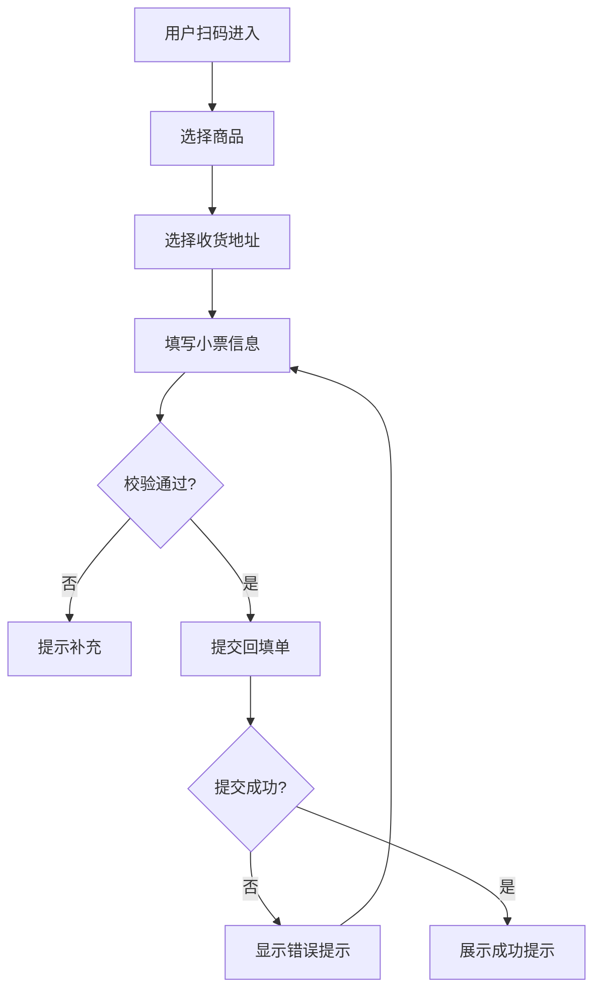
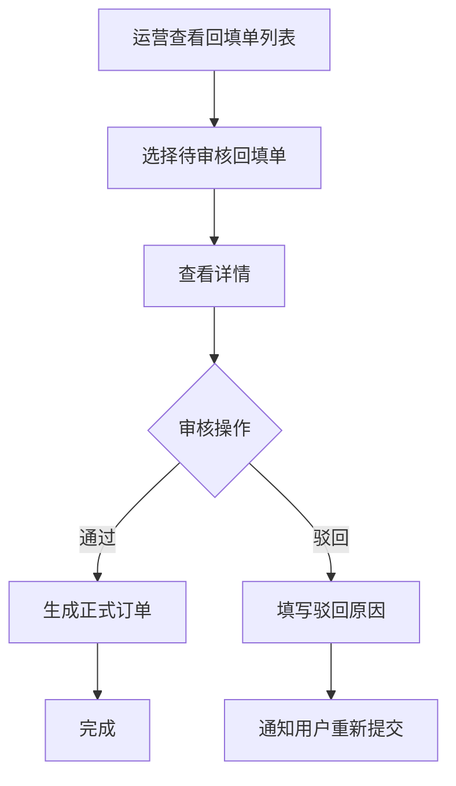
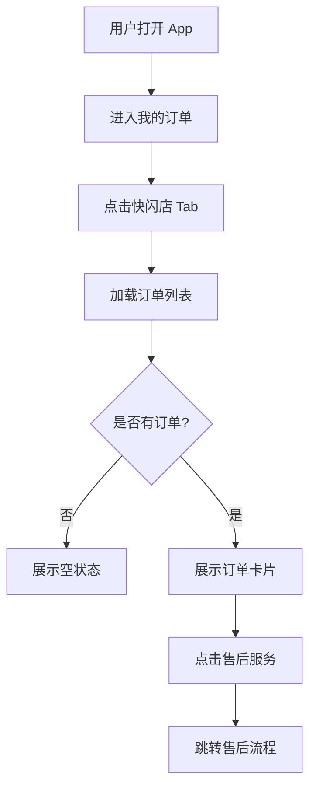

# 快闪店预售商品回填单 PRD v1.3

## 1. 项目信息与版本记录
- **产品名称**：快闪店预售商品回填单
- **版本**：v1.3
- **负责人**：林长宇
- **创建时间**：2026-06-12

### 版本迭代记录
| 版本 | 日期 | 变更项 | 负责人 |
| --- | --- | --- | --- |
| v1.0 | 2026-03-30 | 初版需求确认，H5 回填单 + 运营后台功能定义 | 产品经理 |
| v1.1 | 2026-03-30 | 增加用户注册登录逻辑，优化产品细节 | 林长宇 |
| v1.2 | 2026-04-06 | 新增 App 端快闪店订单列表展示页 | 林长宇 |
| v1.3 | 2026-06-12 | 新增商家后台支持发货逻辑（支持订单类型商家发货） | 林长宇 |


### 参考文档
| 项目 | 地址 | 备注 |
| --- | --- | --- |
| 普通/虚拟商品及订单流程 | https://wiki.imgo.tv/pages/viewpage.action?pageId=48202759 | 商品类型=28 |

## 2. 需求背景与目标
### 2.1 现状问题与痛点
解决线下快闪店销售预售商品时，收集用户收货地址的完整可靠解决方案，方便后续发货。

### 2.2 需求提出的必要性
- 之前通过第三方合作方提供类似数据，导入分销系统
- 之后要使用自研线下收银系统，需要自行研发
- 现有流程无法满足快速收集用户信息并生成正式订单的需求

### 2.3 业务目标
| 目标类型 | 描述 | 衡量指标 | 目标值 |
| --- | --- | --- | --- |
| 业务稳定 | 用户完成回填单填写，运营审核后生成正式订单 | 回填单提交成功率 | ≥95% |
| 体验风险 | 简化用户填写流程，快速完成信息收集 | 平均填写时长 | ≤3分钟 |
| 运营效率 | 运营快速审核，减少人工干预 | 审核平均时长 | ≤5分钟/单 |
| 数据准确性 | 确保收货地址和小票信息准确 | 订单地址错误率 | ≤1% |

## 3. 用户与使用场景
### 3.1 核心用户
- **线下消费者**：在快闪店购买预售商品的用户
- **运营人员**：负责线下场次配置和订单审核
- **商家/仓库人员**：本次新增的发货执行角色

### 3.2 典型场景
1. 用户在快闪店购买预售商品，付款后扫码进入回填单页面
2. 用户填写商品信息、收货地址、小票信息并提交
3. 运营人员在后台查看回填单列表，进行审核
4. 审核通过后生成正式订单
5. 若订单类型为“商家发货”，由商家/仓库在商家后台发货并填写运单信息，用户在 App 中查看物流状态

### 3.3 核心用户旅程
| 阶段 | 用户触点 | 用户行为 | 痛点/情绪 | 产品机会 |
| --- | --- | --- | --- | --- |
| 到达 | 扫码入口 | 扫描线下场次二维码进入回填单页面 | 不确定要填什么 | 清晰展示填写指引 |
| 选择商品 | 商品列表 | 浏览并选择预售商品，设定数量 | 商品信息不清晰 | 展示商品图、名称、规格、价格 |
| 填写地址 | 地址选择 | 从地址本选择收货地址或新建地址 | 地址输入繁琐 | 复用已有地址本功能 |
| 小票信息 | 小票录入 | 输入小票号码，上传小票照片 | 照片上传麻烦 | 支持多张照片上传 |
| 提交 | 提交按钮 | 确认信息并提交 | 担心提交失败 | 明确成功反馈 |
| 审核 | 后台审核 | 运营审核回填单，生成订单 | 等待时间长 | 快速审核机制 |
| 发货 | 商家后台发货 | 商家/仓库填写运单并发货 | 发货流程不清晰 | 提供商家发货模板与指引 |
| 查看订单 | App 订单列表 | 用户在 App 查看快闪店订单 | 找不到订单入口 | 独立订单列表入口 |

## 4. 需求功能清单

### 4.1 H5 回填单端
| 功能模块 | 功能点 | 优先级 | 功能标识 |
| --- | --- | --- | --- |
| 回填单填写 | 填写回填单（商品选择、收货地址、小票信息） | P0 | h5_back_form_edit |
| 回填单成功弹层 | 提交成功，展示完整回填单信息，请提供保存到相册功能 | P0 | h5_back_form_success |

### 4.2 运营后台端
| 功能模块 | 功能点 | 优先级 | 功能标识 |
| --- | --- | --- | --- |
| 快闪店-线下场次管理 | 线下场次新增、编辑、配置 | P0 | admin_activity_admin |
| 快闪店-回填单管理 | 回填单列表、审核 | P0 | admin_back_form_admin |
| 快闪店-商家发货管理 | 支持商家发货的订单类型、商家填写运单并标记发货 | P0 | admin_shipments_admin |

### 4.3 App 端（新增）
| 功能模块 | 功能点 | 优先级 | 功能标识 |
| --- | --- | --- | --- |
| 快闪店订单列表 | 展示快闪店订单列表，包含商品列表和物流信息 | P0 | app_my_order_list |
| 快闪店订单详情 - 待发货 | 展示快闪店订单详情 | P0 | app_my_order_details_waiting_out |
| 快闪店订单详情 - 已完成 | 展示快闪店订单详情 | P0 | app_my_order_details_completed |
| 快闪店订单详情 - 待收货 | 展示快闪店订单详情 | P0 | app_my_order_details_waiting_receive |
| 快闪店订单详情 - 售后处理 | 展示快闪店订单详情 | P0 | app_my_order_details_after_sale |

（以下章节内容基于 v1.2 完整恢复，v1.3 在 5.2 中做了明确的新增标注）

## 5. 详细方案
### 5.1 H5回填单端

#### 5.1.1 回填单填写（h5_back_form_edit）
**功能描述**：用户进入回填单填写界面后，完成商品选择、收货地址、小票信息的填写，并提交回填单。

**详细逻辑**：
- 用户扫码进入回填单填写页面，支持 APP 扫码、微信扫码，未登录时，需先登录
- 页面加载后，基于线下场次 ID 拉取可售预售商品池
- 商品以一行两个卡片展示，卡片包含：商品图、名称、SKU 规格、价格、数量选择器
- 数量选择器采用 `- / +` 方式，默认数量为 0，至少选择 1 件商品才可提交
- 收货地址支持从地址本选择和新建地址
- 小票号码、小票照片均为必填
- 表单一次性展示：商品选择 → 收货地址 → 小票信息，支持页面内上下滚动
- 点击提交后执行校验，校验通过后调用提交接口

**交互设计**：
- 商品卡片圆角展示，选中后显示数量状态
- 价格信息高亮，数量操作区可点击面积偏大
- 提交按钮固定底部，提交中展示 loading 状态
- 校验失败时给出明确提示，并引导回到对应输入区

**数据流向**：
```
前端加载页面 → 获取商品池数据 → 用户填写表单
→ 前端校验 → API提交回填单 → 返回提交结果
```

#### 5.1.2 回填单成功弹层（h5_back_form_success）
**功能描述**：回填单提交成功后，展示成功态弹层，反馈完整回填单信息，并提供保存到相册能力。

**详细逻辑**：
- 提交成功后展示成功弹层
- 弹层展示完整信息：回填单编号、商品列表、收货地址、小票号码
- 支持"保存到相册"操作，便于用户留存凭证

**交互设计**：
- 成功态图标与标题突出，强化反馈确认感
- 信息区分组展示，避免内容堆叠
- "保存到相册"按钮主操作样式明确，点击反馈清晰

**数据流向**：
```
用户提交回填单 → API返回成功 → 展示成功弹层
→ 用户保存到相册/继续后续操作
```

### 5.2 运营后台端

#### 5.2.1 快闪店-线下场次管理（admin_activity_admin）
**功能描述**：运营在后台完成线下场次的新增、编辑与配置，生成可用于用户填写回填单的入口。

**详细逻辑**：
- 场次列表：展示全部线下场次，支持按状态、时间、关键词筛选
- 新增场次：配置场次名称、说明、时间区间、关联商品池、订单渠道
- 编辑场次：支持修改基础信息与状态（启用/禁用）
- 场次配置完成后生成对应回填单二维码/链接
- 禁用场次后，用户端不可继续提交新回填单

**交互设计**：
- 列表区与配置区分栏布局，减少运营切换成本
- 关键字段（场次名称、时间、商品池）提供必填校验
- 状态操作（启用/禁用）二次确认，避免误操作

**数据流向**：
```
运营配置场次信息 → 后台保存场次配置
→ 生成回填单入口（二维码/链接）→ 用户端使用
```

#### 5.2.2 快闪店-回填单管理（admin_back_form_admin）
**功能描述**：运营对用户提交的回填单进行列表管理与审核处理。

**详细逻辑**：
- 回填单列表展示：回填单编号、场次、用户信息、提交时间、审核状态
- 支持筛选与搜索：场次、手机号、小票号、状态、日期区间
- 审核详情页：展示商品信息、收货地址、小票信息、提交记录
- 审核操作：
  - 审核通过：进入后续履约流程
  - 审核驳回：必须填写驳回原因并回写状态
- 支持导出列表用于线下对账

**交互设计**：
- 列表支持快捷筛选与批量导出
- 审核按钮与状态标签区分明显（待审核/已通过/已驳回）
- 驳回时强制填写原因，保证可追溯性

**数据流向**：
```
用户提交回填单 → 后台列表入库
→ 运营审核（通过/驳回）→ 更新回填单状态
```

#### 5.2.3 快闪店-商家发货管理（admin_shipments_admin）
**本期新增**：支持商家后台直接执行发货操作，针对订单类型为“商家发货”的订单，商家/仓库填写运单信息并标记发货。

**功能描述**：商家在后台管理发货，包括单个/批量发货、填写物流公司与运单号、导出发货清单和处理异常。

**核心功能点**：
- 订单筛选：按场次、回填单号、商家订单号、订单状态（待发货/已发货/发货异常）筛选
- 发货操作：支持批量或单笔发货；发货时填写物流公司、运单号、包裹件数、发货仓库（可选）、发货时间和备注
- 发货确认：点击“标记为已发货”，系统将订单状态改为“已发货/出库中”，并触发用户通知（站内信/短信/推送）
- 物流信息编辑：支持回写/更新运单号与物流公司，以及上传发货单据图片
- 异常处理：发货异常（缺货、拣货失败）可标记为“发货异常”，支持记录原因并生成补寄单或交由运营处理
- 导出/对账：支持导出发货清单（CSV/Excel）用于线下对账

**交互设计**：
- 发货信息字段集中展示，物流公司与运单号输入清晰可编辑
- 批量发货入口明显，导出按钮提供复核与对账支持
- 异常订单带红色标签，支持快速跳转异常详情

**数据流向**：
```
商家后台发货 → 填写物流信息 → 系统更新订单状态为已发货
→ 推送物流信息至用户App/通知运营
```

**说明**：该模块为对现有后台回填单管理的扩展，主要放开订单类型支持由商家发货（原运营发货路径保留），并提供商家发货模板与基础字段，便于商家快速执行发货操作（具体字段与流程，后续由 PM 与商家确认）。

### 5.3 App 端（新增）

#### 5.3.1 快闪店订单列表（app_my_order_list）
**功能描述**：在 App“我的订单”页面提供快闪店订单列表展示，用户可以查看所有通过快闪店回填单生成的订单。

**本期新增**：
- 列表支持“快闪店”业务分类过滤
- 待发货状态展示“提醒发货、查看订单”按钮
- 待收货状态展示物流信息与“确认收货”按钮
- 已完成/待评价/已取消支持“删除订单”操作

**详细逻辑**：
- 用户进入 App 我的订单 → 点击“快闪店”子 Tab
- 页面加载后，基于用户 ID 拉取快闪店订单列表
- 订单按下单时间倒序排列
- 支持按订单状态筛选：全部、待支付、待发货、待收货、待评价
- 订单卡片展示：
  - 店铺信息：快闪店预售活动 | 线下场次名称
  - 订单状态标签（右上角）
  - 商品列表：商品图片、商品名称、SKU 规格、单价、数量
  - 回填单号：关联回填单号（示例：HT202603300001）
  - 实付金额
  - 物流信息（已发货/待收货状态）
  - 底部操作按钮（根据订单状态动态展示）
- 空状态：无订单时展示"暂无快闪店订单" + 引导按钮

#### 5.3.2 快闪店订单详情 - 待发货（app_my_order_details_waiting_out）
**功能描述**：用户点击待发货状态的订单后，进入订单详情页面，查看订单完整信息，包括物流状态、收货地址、商品明细、订单信息等。

**本期新增**：
- 底部操作栏：不展示任何按钮（隐藏）

**详细逻辑**：
- 页面顶部展示物流状态区：
  - 包裹图标 + "包裹"标题
  - 状态文本："下单成功，商家已接单"
  - 时间戳：如 2026-04-13 09:18:03
- 收货地址卡片：
  - 定位图标 + "送至"前缀 + 完整收货地址
  - 收件人姓名 + 手机号
- 店铺商品区：
  - 店铺名称展示（如：小芒自营1店）
  - 商品列表：商品图片、自营标签（黄色背景）、商品标题、SKU 规格
  - 若商品处于售后审核中，SKU 规格下方展示"售后待审核"橙色文字 + 右箭头
  - 单价（左下） + 数量（右下，如 x1）
  - 商品总计（右侧对齐，如 ¥128）
  - 实付金额：右侧展示"实付金额 ¥128.19" + 下拉箭头，支持展开/收起
- 订单信息区：
  - 订单编号（右侧灰色字体 + "复制"蓝色按钮）
  - 支付方式（外渠支付）
  - 下单时间
  - 交易流水号
  - "查看更多"可展开更多订单信息（带下拉箭头）
  - 联系客服入口（底部居中，图标 + "联系客服"文字）
- 底部操作栏：本次迭代不展示任何按钮（隐藏）
- 页面加载时调用订单详情接口，获取完整订单数据
- 点击复制按钮，复制订单编号到剪贴板
- 点击"查看更多"展开隐藏字段

#### 5.3.3 快闪店订单详情 - 待收货（app_my_order_details_waiting_receive）
**功能描述**：用户点击待收货状态的订单后，进入订单详情页面，查看物流追踪信息和订单详情，支持确认收货。

**本期新增**：
- 支持物流单号复制
- 展示“确认收货”底部主操作按钮
- 每个商品支持“申请售后”入口

#### 5.3.4 快闪店订单详情 - 已完成（app_my_order_details_completed）
**功能描述**：用户点击已完成状态的订单后，进入订单详情页面，查看订单完整信息。

**本期新增**：
- 订单详情页隐藏物流状态区
- 支持“删除订单”动作显示在详情页与列表页

#### 5.3.5 快闪店订单详情 - 售后处理（app_my_order_details_after_sale）
**功能描述**：用户申请售后时，展示补寄入口。

**本期新增**：
- 售后类型仅展示“申请补寄”选项
- 其余退货/退款入口暂不开放

## 6. 业务流程图
### 6.1 用户端流程


### 6.2 运营端流程


### 6.3 App 订单查看流程


## 7. 异常与边界处理
- 网络异常：用户提交时网络中断，提示“网络不稳定，请检查网络后重试”，保留用户已填写内容
- 重复提交：系统校验小票号唯一性，已存在则提示“该小票号已提交，请勿重复提交”
- 商品下架：线下场次期间商品下架，已选择商品不可删除，但标记为“已下架”，提交时提示“包含已下架商品”
- 线下场次过期：用户访问已过期线下场次，展示“线下场次已结束”提示，不可提交
- 图片上传失败：提示上传失败原因，支持重试上传
- 订单列表加载失败：展示错误提示，提供“重新加载”按钮
- 发货异常：商家发货过程中标记“发货异常”，记录原因并支持补寄或运营复审

## 8. 数据追踪与埋点
无

## 9. 未来演进规划
无

## 10. 附件
无
